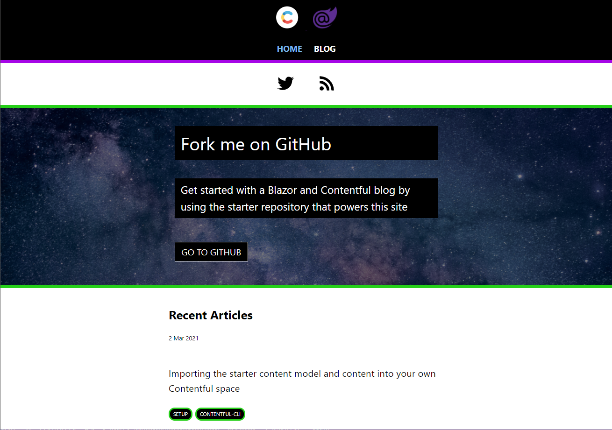
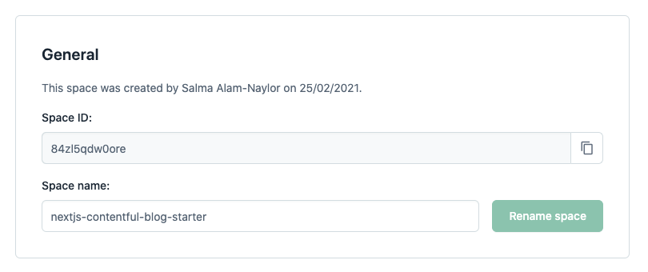
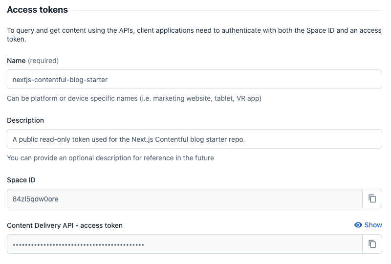
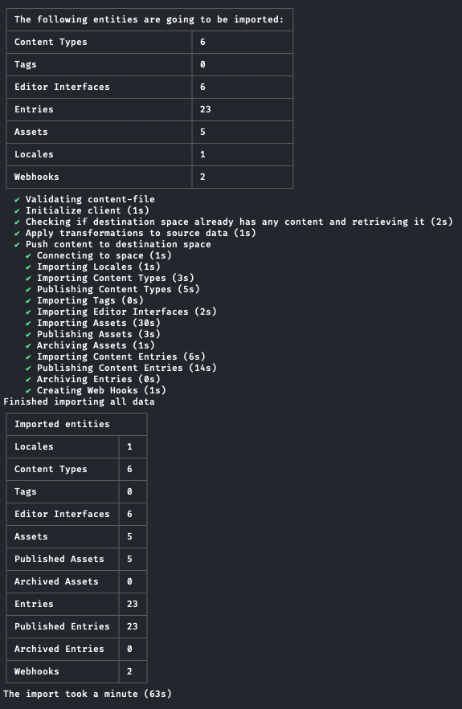
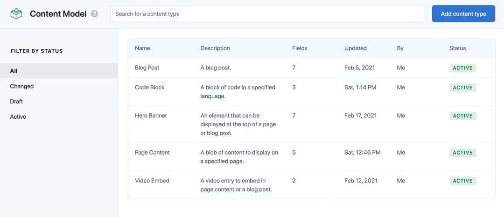

# Blazor + Contentful Blog Starter



This is an example repository for you to use to create a new blog site using Blazor and Contentful, using Contentful's .NET SDK.

[Read more about the .NET SDK](https://www.contentful.com/developers/docs/net/).

## View the demo site

[Click here to explore the demo site that uses this repository as its source code.](https://blazor-contentful-blog-starter.azurewebsites.net/)

## Deploy this site to Azure

The below Deploy to Azure will get you started with this template, when creating your instance you will need your Contentful API keys and Space Id, checkout the sections below to create them. After you can fill in your Contentful details and start the Creation.
There will be a little bit of a wait for the Azure Resources to be created and the initial build/deploy are done.

[](https://portal.azure.com/#create/Microsoft.Template/uri/https%3A%2F%2Fraw.githubusercontent.com%2Fcanhorn%2FBlazor.Contentful.Blog.Starter%2Fmaster%2Fazure%2Fdeploy-to-azure.json)

## Getting set up

Fork the repository to your GitHub account and clone it to your local machine.

~~~bash
#using git
git clone git@github.com:canhorn/Blazor.Contentful.Blog.Starter.git

#using the GitHub CLI
gh repo clone canhorn/Blazor.Contentful.Blog.Starter
~~~

## Configuring your development environment

### Setup appsettings.json

At the root of the project, create a new `appsettings.Development.json` file. Add the following environment variable names to the file:

~~~json
{
    "ContentfulOptions": {
        "DeliveryApiKey": "<Your Deliver Api Key HERE>",
        "PreviewApiKey": "<Your Preview Api Key HERE>",
        "SpaceId": "<Your Space Id HERE>"
    }
}
~~~

### Using example content from Contentful

**You will need to provided your own Contentful account.**

### Creating your Contentful account

To get started with your own Contentful space, [sign up for free](https://www.contentful.com/sign-up/).

Create a new space inside your Contentful account. Go to Settings > General Settings, and make a note of your space ID.



Generate a Content Delivery API access token for your Contentful space.



Add your space ID and access token to your `appsettings.Development.json` file.

## Importing the starter content model and example content into your own Contentful space

To get started quickly on your own version of the application, you can use the Contentful CLI to import the content model and the example content from the starter into your own Contentful space — without touching the Contentful UI!

### Install the Contentful CLI

~~~bash
#using homebrew
brew install contentful-cli

#using npm
npm install -g contentful-cli

#using yarn
yarn global add contentful-cli
~~~

### Authenticate with the CLI

Open a terminal and run:

~~~bash
contentful login
~~~

A browser window will open. Follow the instructions to log in to Contentful via the CLI.

### Import the content model and example content

The following command in your terminal, ensuring you switch out SPACE_ID for your new space ID.

~~~bash
cd Blazor.Contentful.Blog.Starter/Setup

contentful space import --space-id SPACE_ID --content-file content-export.json
~~~

You should see this output in the terminal. The import will take around 1 minute to complete.



Refresh Contentful in your browser, navigate to the content model tab, and you'll find the content types have been imported into your space. You'll find the example content by clicking on the content tab.



## Running the application in development

Navigate to the project directory in a terminal window and run:

~~~bash
dotnet watch run
~~~

## Cache Busting (WebHook registration)

After your Azure instance, or other chosen deployment method, you will need to register a WebHook, ```https://<your-domain>/webhook/cache-buster``` with Contentful. This WebHook is used by the Blazor Contentful Blog Starter application to know when it should clear its cache and request fresh CMS data from Contentful.

I will not go over this process on this repository, but you can check [Intro to webhooks](https://www.contentful.com/developers/docs/concepts/webhooks) for more details.
